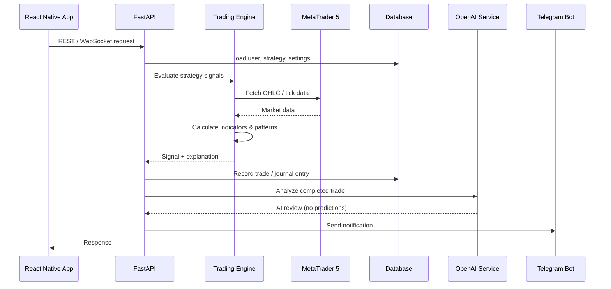
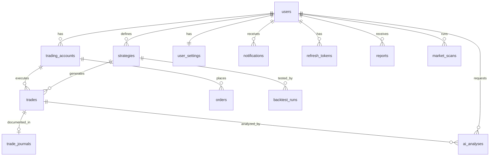

# Architecture Documentation

## System Design

The AI Trading Assistant follows **Clean Architecture** with clear separation of concerns, dependency injection via FastAPI's `Depends`, and the **Repository Pattern** for data access.

---

## Data Flow



---

## Database Schema (ER Overview)



### Table Summary

| Table | Purpose |
|-------|---------|
| `users` | Authentication, profile, role |
| `refresh_tokens` | JWT refresh token rotation |
| `email_verifications` | Email verification flow |
| `password_resets` | Forgot password flow |
| `trading_accounts` | MT5/XM broker accounts |
| `strategies` | User-defined strategy configs (JSON) |
| `trades` | Executed trades with full audit |
| `orders` | Order requests to MT5 |
| `trade_journals` | Notes, emotion, screenshots |
| `ai_analyses` | AI explanations and reviews |
| `reports` | Daily/weekly/monthly AI reports |
| `user_settings` | Risk limits, notifications, preferences |
| `notifications` | In-app notification queue |
| `backtest_runs` | Strategy backtest results |
| `market_scans` | Scanner result snapshots |
| `economic_events` | Cached economic calendar |

---

## Security Architecture

| Concern | Implementation |
|---------|----------------|
| Authentication | Optional API key header (`X-API-Key`) when `API_KEY` is set |
| Password storage | Not used — single-user, no login |
| Broker credentials | Fernet encryption at rest |
| API validation | Pydantic v2 schemas |
| SQL injection | SQLAlchemy parameterized queries |
| Rate limiting | Per-IP middleware (Step 2) |
| Secrets | Environment variables only |
| Live trading | Requires `live_trading_confirmed=true` |

---

## Trading Engine Design (Upcoming Steps)

```
Market Data (MT5)
       │
       ▼
┌──────────────┐
│  Indicators  │  EMA, RSI, MACD, ATR, Bollinger, etc.
└──────┬───────┘
       ▼
┌──────────────┐
│   Patterns   │  Candlestick + Chart patterns
└──────┬───────┘
       ▼
┌──────────────┐
│   Strategy   │  Entry/exit conditions evaluation
│   Engine     │
└──────┬───────┘
       ▼
┌──────────────┐
│     Risk     │  Position sizing, daily loss limits
│  Management  │
└──────┬───────┘
       ▼
┌──────────────┐
│    Order     │  Market/pending orders via MT5 API
│  Execution   │
└──────────────┘
```

---

## AI Service Rules

The AI module is designed with strict guardrails:

1. **Never predict prices** — only explain current conditions
2. **Never guarantee profits** — always state uncertainty
3. **Analyze past trades** — identify patterns in behavior
4. **Suggest improvements** — risk management, not trade signals
5. **Generate reports** — summarize performance with disclaimers

Prompt templates will be stored in `backend/app/ai/prompts/` (Step 8).

---

## Deployment Architecture (Production)

```
Internet
    │
    ▼
┌─────────┐
│  Nginx  │  HTTPS termination, reverse proxy
└────┬────┘
     │
     ▼
┌─────────┐     ┌──────────┐     ┌─────────┐
│ FastAPI │────►│ Postgres │     │  Redis  │
│ (Docker)│     └──────────┘     └─────────┘
└────┬────┘
     │
     ▼
┌─────────┐
│   MT5   │  Windows VPS or local terminal
│ Terminal│
└─────────┘
```

GitHub Actions CI/CD pipeline (Step 13) will run tests, build Docker images, and deploy to Ubuntu VPS.
